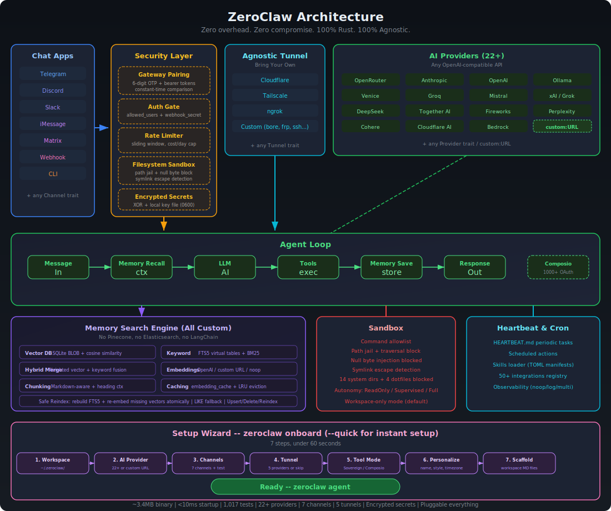

<p align="center">
  
</p>

<h1 align="center">ZeroClaw 🦀</h1>

<p align="center">
  <strong>Zero overhead. Zero compromise. 100% Rust. 100% Agnostic.</strong>
</p>

<p align="center">
  <a href="LICENSE"></a>
</p>

The fastest, smallest, fully autonomous AI assistant — deploy anywhere, swap anything.

```
~3.4MB binary · <10ms startup · 1,017 tests · 22+ providers · 8 traits · Pluggable everything
```

## Quick Start

```bash
git clone https://github.com/theonlyhennygod/zeroclaw.git
cd zeroclaw
cargo build --release

# Quick setup (no prompts)
cargo run --release -- onboard --quick --api-key sk-... --provider openrouter

# Or interactive wizard
cargo run --release -- onboard

# Chat
cargo run --release -- agent -m "Hello, ZeroClaw!"

# Interactive mode
cargo run --release -- agent

# Start the gateway (webhook server)
cargo run --release -- gateway                # default: 127.0.0.1:8080
cargo run --release -- gateway --port 0       # random port (security hardened)

# Check status
cargo run --release -- status --verbose

# List tools (includes memory tools)
cargo run --release -- tools list

# Test a tool directly
cargo run --release -- tools test memory_store '{"key": "lang", "content": "User prefers Rust"}'
cargo run --release -- tools test memory_recall '{"query": "Rust"}'

# List integrations
cargo run --release -- integrations list
```

> **Tip:** Run `cargo install --path .` to install `zeroclaw` globally, then use `zeroclaw` instead of `cargo run --release --`.

## Architecture

Every subsystem is a **trait** — swap implementations with a config change, zero code changes.

<p align="center">
  
</p>

| Subsystem | Trait | Ships with | Extend |
|-----------|-------|------------|--------|
| **AI Models** | `Provider` | 22+ providers (OpenRouter, Anthropic, OpenAI, Ollama, Venice, Groq, Mistral, xAI, DeepSeek, Together, Fireworks, Perplexity, Cohere, Bedrock, etc.) | `custom:https://your-api.com` — any OpenAI-compatible API |
| **Channels** | `Channel` | CLI, Telegram, Discord, Slack, iMessage, Matrix, Webhook | Any messaging API |
| **Memory** | `Memory` | SQLite with hybrid search (FTS5 + vector cosine similarity), Markdown | Any persistence backend |
| **Tools** | `Tool` | shell, file_read, file_write, memory_store, memory_recall, memory_forget, composio (optional) | Any capability |
| **Observability** | `Observer` | Noop, Log, Multi | Prometheus, OTel |
| **Runtime** | `RuntimeAdapter` | Native (Mac/Linux/Pi) | Docker, WASM |
| **Security** | `SecurityPolicy` | Gateway pairing, sandbox, allowlists, rate limits, filesystem scoping, encrypted secrets | — |
| **Tunnel** | `Tunnel` | None, Cloudflare, Tailscale, ngrok, Custom | Any tunnel binary |
| **Heartbeat** | Engine | HEARTBEAT.md periodic tasks | — |
| **Skills** | Loader | TOML manifests + SKILL.md instructions | Community skill packs |
| **Integrations** | Registry | 50+ integrations across 9 categories | Plugin system |

### Memory System (Full-Stack Search Engine)

All custom, zero external dependencies — no Pinecone, no Elasticsearch, no LangChain:

| Layer | Implementation |
|-------|---------------|
| **Vector DB** | Embeddings stored as BLOB in SQLite, cosine similarity search |
| **Keyword Search** | FTS5 virtual tables with BM25 scoring |
| **Hybrid Merge** | Custom weighted merge function (`vector.rs`) |
| **Embeddings** | `EmbeddingProvider` trait — OpenAI, custom URL, or noop |
| **Chunking** | Line-based markdown chunker with heading preservation |
| **Caching** | SQLite `embedding_cache` table with LRU eviction |
| **Safe Reindex** | Rebuild FTS5 + re-embed missing vectors atomically |

The agent automatically recalls, saves, and manages memory via tools.

```toml
[memory]
backend = "sqlite"          # "sqlite", "markdown", "none"
auto_save = true
embedding_provider = "openai"
vector_weight = 0.7
keyword_weight = 0.3
```

## Security

ZeroClaw enforces security at **every layer** — not just the sandbox. It passes all items from the community security checklist.

### Security Checklist

| # | Item | Status | How |
|---|------|--------|-----|
| 1 | **Gateway not publicly exposed** | ✅ | Binds `127.0.0.1` by default. Refuses `0.0.0.0` without tunnel or explicit `allow_public_bind = true`. |
| 2 | **Pairing required** | ✅ | 6-digit one-time code on startup. Exchange via `POST /pair` for bearer token. All `/webhook` requests require `Authorization: Bearer <token>`. |
| 3 | **Filesystem scoped (no /)** | ✅ | `workspace_only = true` by default. 14 system dirs + 4 sensitive dotfiles blocked. Null byte injection blocked. Symlink escape detection via canonicalization. |
| 4 | **Access via tunnel only** | ✅ | Gateway refuses public bind without active tunnel. Supports Tailscale, Cloudflare, ngrok, or any custom tunnel. |

> **Run your own nmap:** `nmap -p 1-65535 <your-host>` — ZeroClaw binds to localhost only, so nothing is exposed unless you explicitly configure a tunnel.

### Layer 1: Gateway Hardening

```bash
# Default — localhost only, pairing required
zeroclaw gateway

# Random port — OS assigns ephemeral port (49152-65535)
zeroclaw gateway --port 0

# With tunnel — public access via secure tunnel only
zeroclaw gateway  # with [tunnel] configured
```

On startup, the gateway prints a **6-digit pairing code**:

```
🔐 PAIRING REQUIRED — use this one-time code:
   ┌──────────────┐
   │  482917  │
   └──────────────┘
   Send: POST /pair with header X-Pairing-Code: 482917
```

After pairing, all subsequent requests use `Authorization: Bearer zc_<token>`.

```toml
[gateway]
require_pairing = true      # default: true
allow_public_bind = false   # default: false — NEVER set true without tunnel
```

### Layer 2: Channel Authentication

Every channel validates the sender **before** the message reaches the agent loop:

| Channel | Auth Method | Config |
|---------|------------|--------|
| **Telegram** | `allowed_users` list (username match) | `[channels.telegram] allowed_users` |
| **Discord** | `allowed_users` list (user ID match) | `[channels.discord] allowed_users` |
| **Slack** | `allowed_users` list (user ID match) | `[channels.slack] allowed_users` |
| **Matrix** | `allowed_users` list (MXID match) | `[channels.matrix] allowed_users` |
| **iMessage** | `allowed_contacts` list | `[channels.imessage] allowed_contacts` |
| **Webhook** | `X-Webhook-Secret` header (shared secret) | `[channels.webhook] secret` |
| **CLI** | Local-only (inherently trusted) | — |

> **Note:** An empty `allowed_users` list or `["*"]` allows all users (open mode). Set specific IDs for production.

### Layer 3: Rate Limiting

- **Sliding-window tracker** — counts actions within a 1-hour rolling window
- **`max_actions_per_hour`** — hard cap on tool executions (default: 20)
- **`max_cost_per_day_cents`** — daily cost ceiling (default: $5.00)

### Layer 4: Filesystem Sandbox

- **Workspace-only mode** (default) — all paths must be relative to workspace
- **14 system directories blocked** — `/etc`, `/root`, `/home`, `/usr`, `/bin`, `/sbin`, `/lib`, `/opt`, `/boot`, `/dev`, `/proc`, `/sys`, `/var`, `/tmp`
- **4 sensitive dotfiles blocked** — `~/.ssh`, `~/.gnupg`, `~/.aws`, `~/.config`
- **Null byte injection** — blocked at the path validation layer
- **Path traversal** — `..` in any position is rejected
- **Symlink escape detection** — `is_resolved_path_allowed()` verifies canonicalized paths stay inside workspace
- **Command allowlisting** — only approved shell commands (`git`, `cargo`, `ls`, etc.)
- **Autonomy levels** — `ReadOnly`, `Supervised` (default), `Full`

### Layer 5: Secure Tunnels

Expose your gateway securely — **bring your own tunnel provider**:

| Provider | Binary | Use Case |
|----------|--------|----------|
| **none** | — | Local-only (default) |
| **cloudflare** | `cloudflared` | Cloudflare Zero Trust tunnel |
| **tailscale** | `tailscale` | Tailnet-only (`serve`) or public (`funnel`) |
| **ngrok** | `ngrok` | Quick public URLs, custom domains |
| **custom** | Any | Bring your own: bore, frp, ssh, WireGuard, etc. |

```toml
[tunnel]
provider = "tailscale"   # "none", "cloudflare", "tailscale", "ngrok", "custom"

[tunnel.tailscale]
funnel = true            # true = public internet, false = tailnet only

# Or use Cloudflare:
# [tunnel]
# provider = "cloudflare"
# [tunnel.cloudflare]
# token = "your-tunnel-token"

# Or ngrok:
# [tunnel]
# provider = "ngrok"
# [tunnel.ngrok]
# auth_token = "your-ngrok-token"
# domain = "my-zeroclaw.ngrok.io"  # optional

# Or bring your own:
# [tunnel]
# provider = "custom"
# [tunnel.custom]
# start_command = "bore local {port} --to bore.pub"
# url_pattern = "https://"         # regex to extract URL from stdout
# health_url = "http://localhost:4040/api/tunnels"  # optional
```

The tunnel starts automatically with `zeroclaw gateway` and prints the public URL.

## Configuration

Config: `~/.zeroclaw/config.toml` (created by `onboard`)

```toml
api_key = "sk-..."
default_provider = "openrouter"
default_model = "anthropic/claude-sonnet-4-20250514"
default_temperature = 0.7

[memory]
backend = "sqlite"              # "sqlite", "markdown", "none"
auto_save = true
embedding_provider = "openai"   # "openai", "noop"
vector_weight = 0.7
keyword_weight = 0.3

[gateway]
require_pairing = true          # require pairing code on first connect
allow_public_bind = false       # refuse 0.0.0.0 without tunnel

[autonomy]
level = "supervised"            # "readonly", "supervised", "full"
workspace_only = true
allowed_commands = ["git", "npm", "cargo", "ls", "cat", "grep"]
forbidden_paths = ["/etc", "/root", "/proc", "/sys", "~/.ssh", "~/.gnupg", "~/.aws"]

[heartbeat]
enabled = false
interval_minutes = 30

[tunnel]
provider = "none"               # "none", "cloudflare", "tailscale", "ngrok", "custom"

[secrets]
encrypt = true                  # API keys encrypted with local key file

[composio]
enabled = false                 # opt-in: 1000+ OAuth apps via composio.dev
```

## Gateway API

| Endpoint | Method | Auth | Description |
|----------|--------|------|-------------|
| `/health` | GET | None | Health check (always public, no secrets leaked) |
| `/pair` | POST | `X-Pairing-Code` header | Exchange one-time code for bearer token |
| `/webhook` | POST | `Authorization: Bearer <token>` | Send message: `{"message": "your prompt"}` |

### Random Port Mode

Use `--port 0` for OS-assigned random ephemeral ports (security hardening against port scanning):

```bash
zeroclaw gateway --port 0
# Output: 🦀 ZeroClaw Gateway listening on http://127.0.0.1:54321 (random port)
```

The actual port is printed on startup and passed to the tunnel system automatically.

## Commands

| Command | Description |
|---------|-------------|
| `onboard` | Setup wizard (`--quick` for non-interactive) |
| `agent -m "..."` | Single message mode |
| `agent` | Interactive chat mode |
| `gateway` | Start webhook server (default: `127.0.0.1:8080`) |
| `gateway --port 0` | Random port mode |
| `status -v` | Show full system status |
| `tools list` | List available tools |
| `tools test <name> <json>` | Test a tool directly |
| `integrations list` | List all 50+ integrations |

## Documentation Index

Fetch the complete documentation index at: https://docs.openclaw.ai/llms.txt

## Development

```bash
cargo build              # Dev build
cargo build --release    # Release build (~3.4MB)
cargo test               # 1,017 tests
cargo clippy             # Lint (0 warnings)
cargo fmt                # Format

# Run the SQLite vs Markdown benchmark
cargo test --test memory_comparison -- --nocapture
```

### Test Coverage

| Module | Tests | Covers |
|--------|-------|--------|
| **Memory (SQLite)** | 100+ | FTS5, vector search, hybrid merge, embeddings, chunker, SQL injection, unicode |
| **Security (Policy)** | 50+ | Path traversal, null bytes, forbidden dirs, workspace scoping, symlink escapes |
| **Security (Pairing)** | 20+ | Code generation, token issuance, constant-time comparison, replay prevention |
| **Gateway** | 20+ | Port 0, random port allocation, header extraction, port conflicts |
| **Config** | 30+ | Serde roundtrip, backward compat, secure defaults, gateway config |
| **Providers** | 30+ | Factory, custom URLs, auth styles |
| **Tools** | 20+ | Schema validation, tool specs, serde |
| **Integrations** | 15+ | Registry completeness, status functions, categories |
| **Tunnel** | 20+ | Factory, constructors, async behavior |

## Project Structure

```
src/
├── main.rs              # CLI (clap) — 10 subcommands
├── lib.rs               # Library exports (8 modules)
├── agent/               # Agent loop + memory context injection
│   ├── mod.rs
│   └── loop_.rs
├── channels/            # Channel trait + 7 implementations
│   ├── traits.rs        # Channel trait definition
│   ├── cli.rs           # Local terminal
│   ├── telegram.rs      # Telegram Bot API
│   ├── discord.rs       # Discord bot
│   ├── slack.rs         # Slack bot
│   ├── matrix.rs        # Matrix protocol
│   ├── imessage.rs      # macOS iMessage
│   └── mod.rs           # System prompt builder
├── config/              # TOML config schema
│   ├── schema.rs        # All config structs + defaults
│   └── mod.rs
├── cron/                # Scheduled tasks
├── gateway/             # HTTP gateway (raw TCP + tokio)
│   └── mod.rs           # /health, /pair, /webhook endpoints
├── heartbeat/           # Periodic task engine
│   ├── engine.rs
│   └── mod.rs
├── integrations/        # 50+ integration registry
│   ├── registry.rs      # All integrations across 9 categories
│   └── mod.rs
├── memory/              # Memory trait + hybrid search engine
│   ├── traits.rs        # Memory trait definition
│   ├── sqlite.rs        # SQLite + FTS5 + vector embeddings
│   ├── markdown.rs      # Append-only markdown
│   ├── embeddings.rs    # EmbeddingProvider trait + OpenAI + Noop
│   ├── vector.rs        # Cosine similarity + serialization + hybrid merge
│   ├── chunker.rs       # Markdown-aware document splitting
│   └── mod.rs           # Factory
├── observability/       # Observer trait + 3 backends
│   ├── traits.rs
│   ├── noop.rs
│   ├── log.rs
│   └── multi.rs
├── onboard/             # Interactive setup wizard
│   └── wizard.rs
├── providers/           # Provider trait + 22+ providers
│   ├── traits.rs        # Provider trait definition
│   ├── openrouter.rs    # OpenRouter (default)
│   ├── anthropic.rs     # Anthropic direct
│   ├── openai.rs        # OpenAI direct
│   ├── ollama.rs        # Local Ollama
│   ├── compatible.rs    # OpenAI-compatible adapter (18+ providers)
│   └── mod.rs           # Factory
├── runtime/             # RuntimeAdapter trait + Native
│   ├── traits.rs
│   └── native.rs
├── security/            # Security policy + gateway pairing + secrets
│   ├── policy.rs        # SecurityPolicy, path validation, rate limiting
│   ├── pairing.rs       # PairingGuard, OTP, bearer tokens
│   ├── secrets.rs       # Encrypted secret store (XOR + local key file)
│   └── mod.rs
├── skills/              # Skill loader (TOML manifests)
│   └── mod.rs
├── tools/               # Tool trait + 7 tools
│   ├── traits.rs        # Tool trait definition
│   ├── shell.rs         # Shell command execution
│   ├── file_read.rs     # Sandboxed file reading
│   ├── file_write.rs    # Sandboxed file writing
│   ├── memory_store.rs  # Store to memory
│   ├── memory_recall.rs # Search memory
│   ├── memory_forget.rs # Delete from memory
│   ├── composio.rs      # Composio OAuth tools (optional)
│   └── mod.rs           # Registry
└── tunnel/              # Tunnel trait + 5 implementations
    ├── none.rs          # Local-only (default)
    ├── cloudflare.rs    # Cloudflare Zero Trust
    ├── tailscale.rs     # Tailscale serve/funnel
    ├── ngrok.rs         # ngrok
    ├── custom.rs        # Bring your own
    └── mod.rs           # Factory

examples/
├── custom_provider.rs
├── custom_channel.rs
├── custom_tool.rs
└── custom_memory.rs

tests/
└── memory_comparison.rs  # SQLite vs Markdown benchmark
```

**64 source files · 17,500 lines of Rust · 1,017 tests · 0 clippy warnings**

## License

MIT — see [LICENSE](LICENSE)

## Contributing

See [CONTRIBUTING.md](CONTRIBUTING.md). Implement a trait, submit a PR:
- New `Provider` → `src/providers/`
- New `Channel` → `src/channels/`
- New `Observer` → `src/observability/`
- New `Tool` → `src/tools/`
- New `Memory` → `src/memory/`
- New `Tunnel` → `src/tunnel/`
- New `Skill` → `~/.zeroclaw/workspace/skills/<name>/`

---

**ZeroClaw** — Zero overhead. Zero compromise. Deploy anywhere. Swap anything. 🦀
